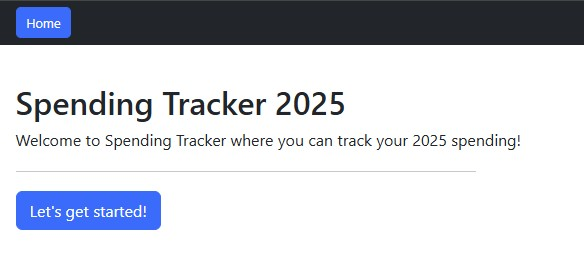
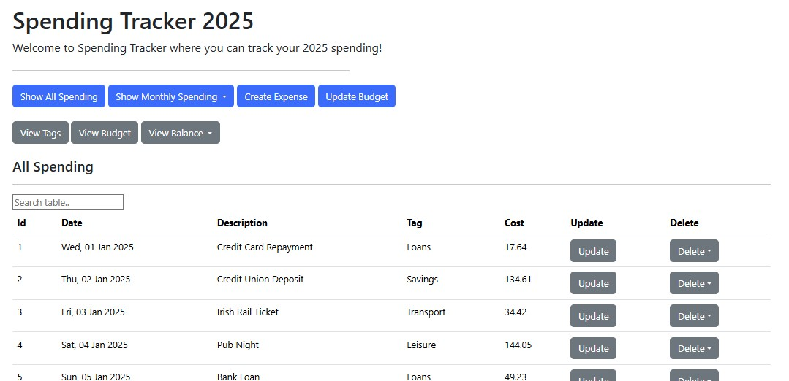
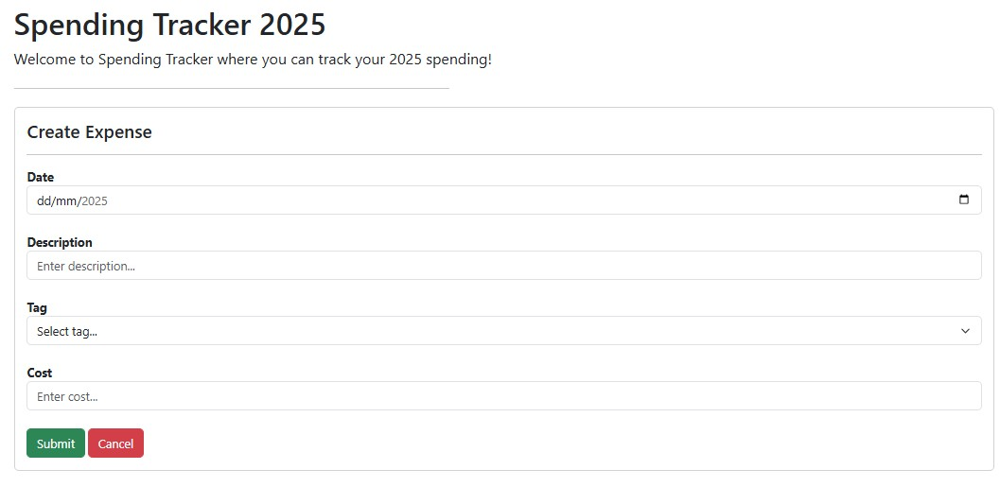

# Web Services and Applications Project
# Spending Tracker 2025

A web application to track and manage your monthly spending. The application provides a simple and interactive interface to input, update and delete daily expenses, view spending history, and update your monthly budget.

## Getting Started

Follow the below steps to get the ``Spending Tracker 2025`` app running on your machine.

### Prerequisites

Make sure you have the following installed:

- Python
- MySQL Server
- pip (Python package installer)

### Installation

1. Clone the repository

    ```bash
    git clone https://github.com/eoghanpw/WSAA-project.git
    cd WSAA-project
    ```

2. Create and activate virtual environment

    ```bash
    python -m venv venv
    ```
    ```bash
    .\venv\Scripts\activate.bat
    ```

3. Install dependencies

    ```bash
    pip install -r requirements.txt
    ```

4. Set up the MySQL database

    Import [`create_spending_tracker_tables.sql`](./data/create_spending_tracker_tables.sql) and [`create_spending_tracker_tables.sql`](./data/spending_data_2025.sql) into MySQL.

5. Update the config file

    Update the MySQL connection settings in the [`mysqlcfg.py`](./mysqlcfg.py) config file wherever applicable.

    ```python
    mysql = {
        "host": "localhost",
        "user": "your_username",
        "password": "your_password",
        "database": "spending_tracker"
    }
    ```

6. Run the Flask server

    ```bash
    python spending_tracker_rest_server.py
    ```
    The server will start at ``http://127.0.0.1:5000``.

7. View the Spending Tracker App

    Copy the path of the [`spending_tracker.html`](./spending_tracker.html) into your browser of choice to get started.

## Usage Examples







## Acknowledgements

- [MySQL documentation](https://dev.mysql.com/doc/refman/9.0/en/)
- [PyMySQL documentation](https://pymysql.readthedocs.io/en/latest/)
- [Flask documentation](https://flask.palletsprojects.com/en/stable/#user-s-guide)
- [Bootstrap documentation](https://getbootstrap.com/docs/5.3/getting-started/introduction/)
- [w3schools HTML](https://www.w3schools.com/html/default.asp)
- [w3schools Javascript](https://www.w3schools.com/js/default.asp)
- [MDN Web Docs HTML](https://developer.mozilla.org/en-US/docs/Learn_web_development/Core/Structuring_content)
- [MDN Web Docs Javascript](https://developer.mozilla.org/en-US/docs/Learn_web_development/Core/Scripting)
- [MDN Web Docs Javascript](https://developer.mozilla.org/en-US/docs/Learn_web_development/Core/Scripting)
- [ChatGPT for test spending data ](https://chatgpt.com/share/6833860a-3164-8010-8578-6a8e115f5ad8)


## Author
Eoghan Walsh